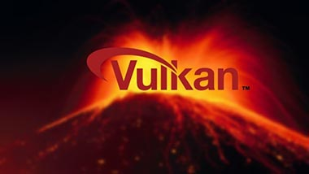

# Vulkan Render

GigaEngineDemo is a Vulkan-based rendering engine demo project. It demonstrates the capabilities of Vulkan for real-time rendering.

## Prerequisites

- Vulkan SDK 1.3.275.0
- GLFW 3.4
- GLM 1.0.1-light
- STB
- TinyObjLoader

## Building

The project uses Visual Studio and vcpkg for dependency management.

1. Install the Vulkan SDK, GLFW, GLM, STB, and TinyObjLoader.
2. Open the `GigaEngineDemo.sln` file in Visual Studio.
3. Select the desired configuration (Debug or Release) and platform (x64 or x86).
4. Build the solution.

## Running

After building the project, you can run the `GigaEngineDemo` executable.

